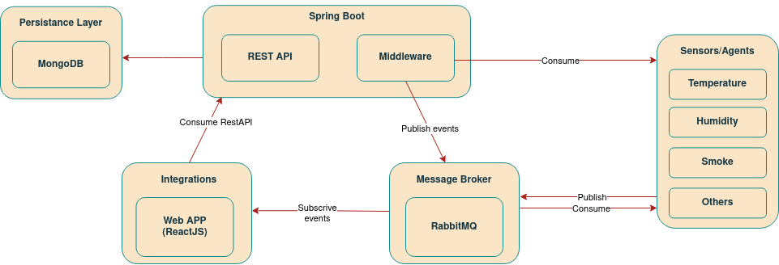

# SensorSafe

- Interactive system to manage Humidity/Temperature/Smoke Sensors 

# About the Project

## Primary Goals:

- Safety Enhancement: Enable users to proactively manage sensor data for fire detection, temperature control, and humidity monitoring, contributing to a safer living and working environment.

- User Empowerment: Provide a user-friendly interface for configuring and customizing sensor thresholds, allowing for personalized automation rules and immediate notifications based on sensor readings.

## Key Features:

- Personalized Automation   

- Real-time Notifications

# Team

| NMec | Name | email | Roles |
|:---: |:--- |:---|:---:|
| 108317 | Miguel Aido Miragaia      | [miguelmiragaia@ua.pt](https://github.com/Miragaia)                  |  Team manager, DevOps     |
| 108536 | Cristiano Antunes Nicolau | [cristianonicolau@ua.pt](https://github.com/cristiano-nicolau)       |  Architect, DevOps        |
| 107572 | Gonçalo Rafael Correia Moreira Lopes  | [goncalorcml@ua.pt](https://github.com/MoreiraLopes)     |  Product Owner, DevOps    |

# Architecture

- ### [Architecture Explanation](reports/Documentation/Architecture.md)

# Database

- ### [Database Explanation](reports/Documentation/Database.md)

# Personas and Scenarios

- ### [Personas and Scenarios Explanation](reports/Documentation/PersonasScenarios.md)

# Bookmarks

## Quick Links

- [All available Project Documentation](reports/)
    
- [Final Report](reports/I3/IES_Project_Specification_ReportFinal.pdf)

- [Project Presentation](reports/I4/IES_Project_Presentation.pdf)

- Running the application:

    - [API_Documentation](http://localhost:8080/swagger-ui/index.html)

## Project Management Board

- Using the Github Porjects feature the tasks and functionalities were divided and organized in a very intuitive and effeecient way.    

# Development

## Branches

- The project is divided in **branches:**
    - `master:` This branch contains the latest stable version of the project and reports (currently the project is not stabeleized).
    - `new/SensorsDevelopment:` This branch contains the latest version of the project, including the latest features and bug fixes.

## Deployment

- Exist two different forms of deployment:

    - [Local Deployment](/reports/Documentation/Deployment.md#local-deployment)
    - [Docker Deployment](/reports/Documentation/Deployment.md#Docker-deployment)

## DataBase Access

- mongosh --username root --password password
