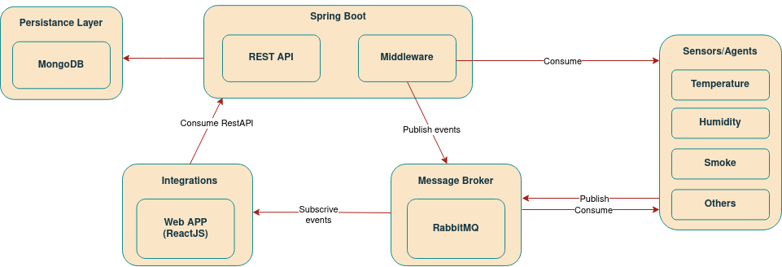

# Architecture

### Data Generation Layer
- Virtual agents in Python simulate real-world sensors (e.g., temperature, humidity). These agents send data through message queues to the backend for processing, with RabbitMQ serving as the message broker.

### Persistance Layer
- MongoDB is chosen as the database to store persistent data. Initially considered MySQL, MongoDB's document-oriented nature was deemed more suitable for our data classes. The middleware/services layer acts as a wrapper for database interactions.

### Middleware/Services Layer
- Implemented in Java and integrated into the Spring Boot application, this layer performs aggregation operations and calculates room statistics. It also notifies the front-end of important data changes. Authentication and Authorization mechanisms secure the Spring Controller exposed by the Middleware.

### Security
- Authentication relies on access tokens (JWT) issued to users upon login. These tokens, stored in the browser's local storage, serve as user authentication for endpoints. Bcrypt encrypts sensitive user data, such as passwords, in the database.

### API Layer
- The REST API, developed in Spring Boot (Java), connects integrations and clients to the system. It interfaces with the Middleware to access databases. Public endpoints, like register and login, are open, while private endpoints require authorization. Clients interact with the API through HTTP requests to retrieve information for presentation in the front-end.

### Front-end
- The system's front-end is built with ReactJS, offering a Single-Page Application (SPA) experience. ReactJS facilitates the creation of a dynamic and responsive user interface.

### Integration and Clients
- Applications and clients connect to the system via a REST API written in Spring Boot. This API, in turn, interfaces with the Middleware to access the databases. HTTP requests are used by applications/clients to query the API for necessary information to be presented in the front-end.
