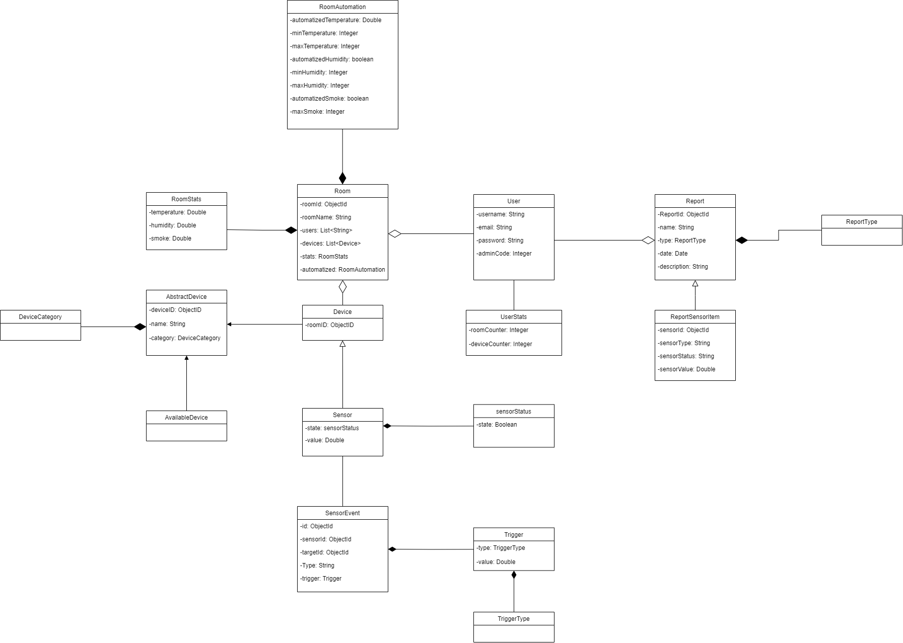

# Database

### User
- The user is the entity that is going to interact with SensorSafe (web application).

### UserStats
- Entity that stores the rooms and devices counter that the user has access.

### Room
- This entity represents the various divisions of a house/building where devices are installed. In our application, each room has a list of associated devices and a list of users who have access to it. Each room contains their own statistics (RoomStats).

### RoomAutomation
- This entity represents the control of the statistic parameters of a room. Allows automation of temperature, humidity, and smoke based on predefined user defined input criteria.

### RoomStats
- This entity holds the up-to-date statistics for a room, including the present temperature, the current humidity, and Smoke levels.

### Report
- An entity that signifies an element about the devices report. It can encapsulate a variety of actions as defined by the ReportType.

### ReportType
- Specifies the various categories of available reports, maintenance, rooms and devices. 

### ReportSensorItem
- A specialized form of ReportType designed to store historical events associated with changes in sensor data. The application generates and preserves a fresh ReportSensorItem whenever there is a modification in the data of a sensor.

### AbstractDevice
- Represents all devices (Sensor, “Device in general”) in the application.

### Device
- This is a subtype of AbstractDevice that represents a “Device in general” (not a sensor) in the application, e.g. air conditioner.

### AvailableDevice
- This is a subtype of Device, representing an available device. An available device implies that a user has the option to add it to a room.

### DeviceCategory
- This represents the different categories of devices. We have 4 categories on our app: temperature, humidity, smoke, and others.

### Sensor
- It is a subtype of Device and represents a sensor in our app.

### SensorStatus
- This entity will retain the sensor's state, indicating whether it is currently in use (it is associated to a room).

### SensorEvent
- This entity represents an event/trigger in the application.

### Trigger
- This entity stores the trigger of a given event. It stores the value at which the event should be triggered and the type of the trigger (instance of TriggerType).

### TriggerType
- It represents the different types of triggers. In our case, we are going to have triggers on a value higher, equals or less to a given limit, e.g. when the temperature of the room is lower than 20 we activate the air conditioner to heat the room.